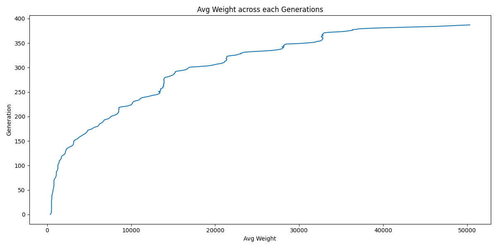
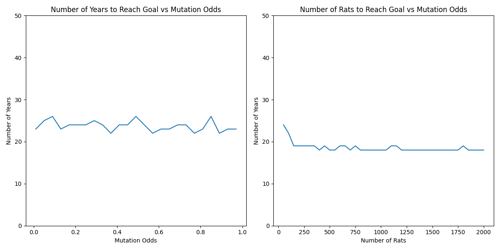

# Breeding Giant rats With Genetic Algorithms!

Genetic Algorithms (GAs) are optimization and search techniques inspired by the principles of natural evolution and genetics. They are used to solve complex optimization and search problems where traditional methods struggle or are inefficient. Invented in the 1970s, they belong to the class of evolutionary algorithms, so named because they mimic the Darwinian process of natural selection.

Here I used genetic algorithm to breed a race of super rats that can terrorize the world😂.
I mean, ofcourse a 50kg giant rat would look scary, wouldn't it?

## Plots

### Average weight across Generations

### Years vs Mutation Probability

### Credit:

Lee Vaughan
